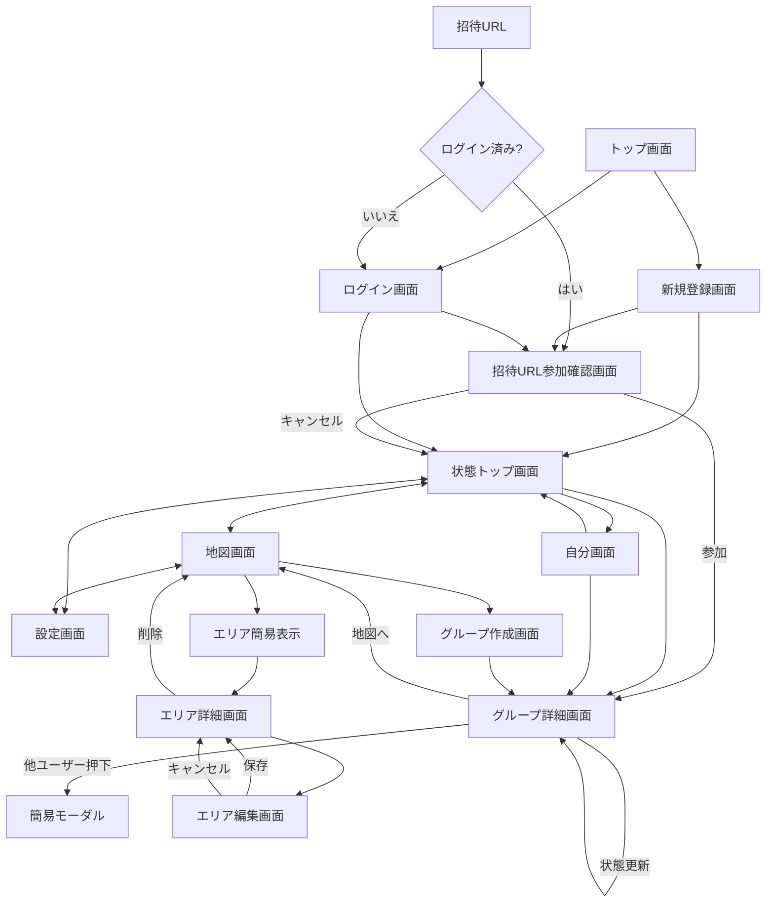

# COCO 画面遷移図（MVP）

## 1. 画面一覧

### ログイン前
- トップ画面
- 新規登録画面
- ログイン画面
- 招待URL参加確認画面

### ログイン後の主要画面
- 状態トップ画面
- 地図画面
- 設定画面

### 詳細画面
- 自分画面
- グループ詳細画面
- グループ作成画面
- エリア詳細画面
- エリア編集画面

---

## 2. 遷移ルール

### 2.1 ログイン前
- トップ画面 → 新規登録画面
- トップ画面 → ログイン画面
- 新規登録画面 → 状態トップ画面
- ログイン画面 → 状態トップ画面

### 2.2 招待URL導線
- 招待URL押下 → 招待URL参加確認画面
- 未ログイン時に招待URLを開いた場合
  - 招待URL押下 → ログイン画面 または 新規登録画面
  - 認証完了後 → 招待URL参加確認画面へ戻る
- 招待URL参加確認画面で参加 → グループ詳細画面
- 招待URL参加確認画面でキャンセル → 状態トップ画面

### 2.3 主要画面間
- 状態トップ画面 ↔ 地図画面
- 状態トップ画面 ↔ 設定画面
- 地図画面 ↔ 設定画面

### 2.4 状態画面まわり
- 状態トップ画面 → 自分画面
- 状態トップ画面 → グループ詳細画面
- 自分画面 → グループ詳細画面
- 自分画面 → 状態トップ画面

### 2.5 グループ詳細画面まわり
- グループ詳細画面 → 地図画面（対象グループを選択済み）
- グループ詳細画面 → 招待URL共有
- グループ詳細画面 → 状態更新
- グループ詳細画面で自分以外のユーザー押下 → 簡易モーダル表示

### 2.6 地図画面まわり
- 地図画面 → グループ作成画面
- グループ作成画面 → グループ詳細画面
- 地図画面で円形エリア押下 → エリア簡易表示
- エリア簡易表示押下 → エリア詳細画面
- エリア詳細画面 → エリア編集画面
- エリア編集画面で保存 → エリア詳細画面
- エリア編集画面でキャンセル → エリア詳細画面
- エリア詳細画面で削除 → 地図画面

---

## 3. 画面ごとの概要

### 3.1 状態トップ画面
- 自分のアイコン / 表示名
- 自分以外の状態一覧
- 一覧項目押下でグループ詳細画面へ遷移

### 3.2 自分画面
- 自分のアイコン / 表示名
- 自分の状態一覧
- 一覧項目押下でグループ詳細画面へ遷移

### 3.3 グループ詳細画面
- 上部にグループアイコンとグループ名
- 自分 → 他メンバーの順で一覧表示
- 各メンバーにエリア名またはエリア外を表示
- 右上メニューまたはボタン群に以下を配置
  - 状態更新
  - 地図画面へ移動
  - 招待URL共有
- 最終更新時刻は一覧には表示しない
- 自分以外のユーザー押下で簡易モーダルを表示
  - 表示名
  - このグループでの状態
  - 最終更新時刻

### 3.4 地図画面
- グループ切り替えUI
- 地図表示
- 定義済みエリア表示
- 右上にグループ作成ボタン
- エリア定義ボタン押下後に、タップアンドドラッグで円形エリア作成
- 指を離すとエリア名入力欄を表示
- 既存エリアを押すと
  - エリア名
  - ユーザーがいる / いない
  を簡易表示
- 簡易表示押下でエリア詳細画面へ遷移

### 3.5 エリア詳細画面
- エリア名
- エリア内ユーザー一覧
- 編集ボタン
- 削除ボタン

### 3.6 エリア編集画面
- エリア名入力欄
- 保存ボタン
- キャンセルボタン
- MVPでは名前変更のみ

### 3.7 グループ作成画面
- グループ名入力
- グループアイコン設定
- 作成後はグループ詳細画面へ遷移

---

## 4. Mermaid 図

